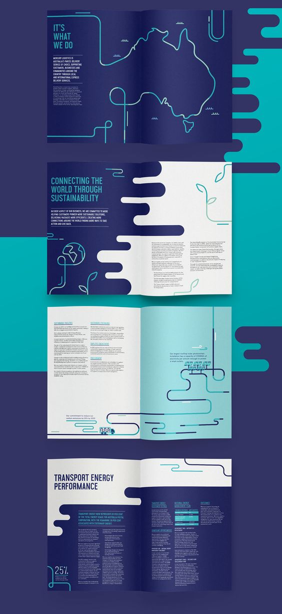
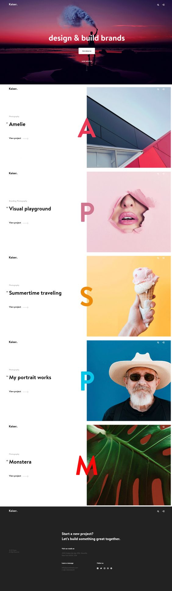
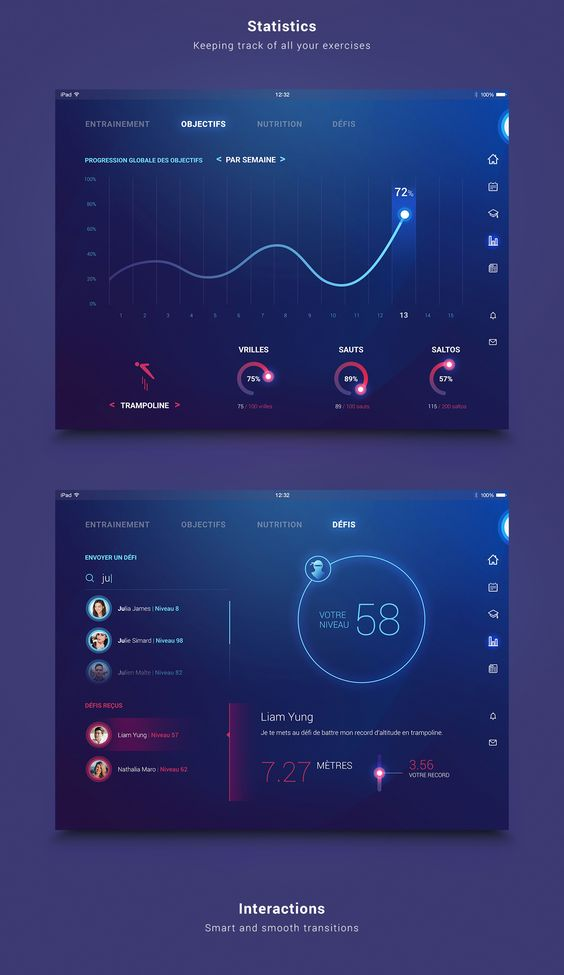
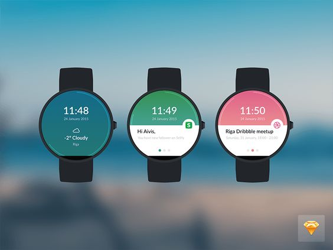
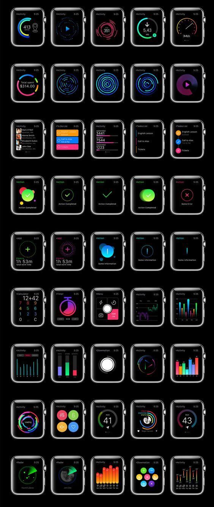
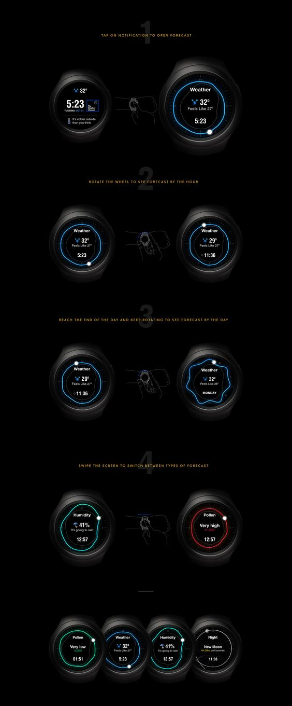
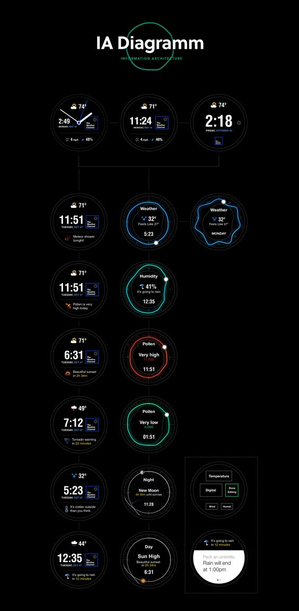

<!--
<body>
    

        

            

                
            

            

                
            

            

                
            

            

                
            

            

                
            

            

                
            

            

                
            

            

                
            

            

                
            

        

    

</body>
-->
